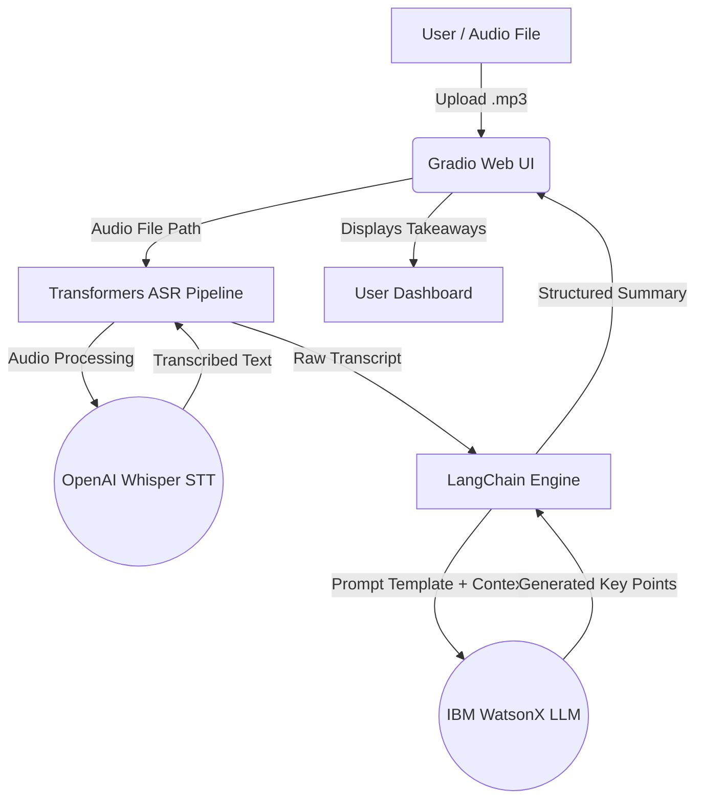
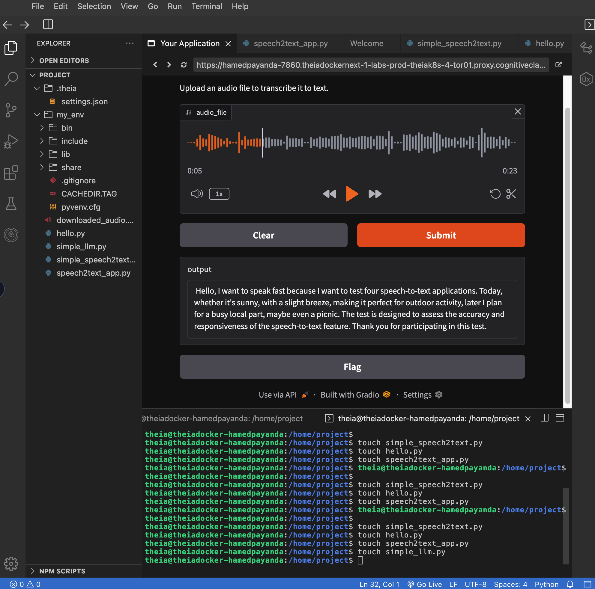
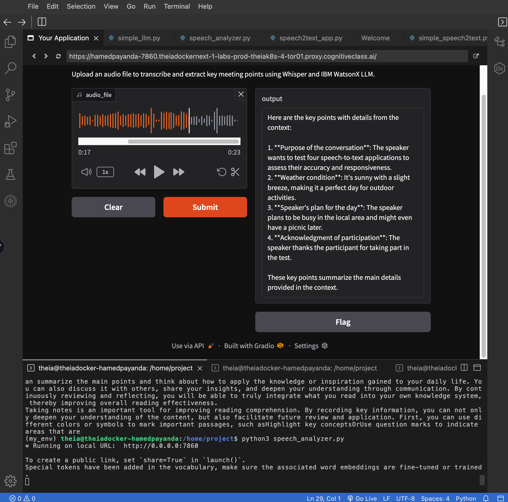

# 🎙️ Business AI Meeting Companion

[](https://www.python.org/)
[](https://pytorch.org/)
[](https://huggingface.co/)
[](https://www.ibm.com/watsonx)
[](https://gradio.app/)
[](https://opensource.org/licenses/MIT)
[](https://cognitiveclass.ai/)


An end-to-end Speech-to-Text (STT) and Meeting Intelligence application. This tool captures audio recordings of business meetings or academic lectures, transcribes them using OpenAI's Whisper, processes the transcript using IBM WatsonX AI (Llama foundation model) via LangChain, and generates structured meeting summaries and key takeaways inside an interactive Gradio web interface.

---

## 📌 Project Overview

In fast-paced business and academic environments, capturing crucial details, decisions, and action items from spoken conversations is essential. **Business AI Meeting Companion** automates this workflow:

1. **Audio Capture:** Upload audio recordings directly through a browser UI.
2. **Speech-to-Text Conversion:** Uses OpenAI's Whisper model to transcribe audio into raw text with high accuracy.
3. **Contextual Intelligence & Summarization:** Passes the transcription to IBM WatsonX LLM via LangChain prompt templates to correct minor phonetic speech errors and extract organized key points.
4. **Interactive Dashboard:** Provides an intuitive web application powered by Hugging Face Gradio.

---

## 🏗️ Architecture Diagram


---

## ✨ Key Features

* **High-Accuracy Automatic Speech Recognition (ASR):** Converts voice recordings to text using OpenAI Whisper.
* **LLM Key Point Extraction:** Uses IBM WatsonX foundation models to synthesize unstructured meeting transcripts into concise, structured bullet points.
* **Grammar & Context Correction:** LLM logic automatically smooths out phonetic transcription errors into coherent business sentences.
* **Interactive UI:** Lightweight, responsive Gradio interface featuring drag-and-drop audio uploads and real-time output rendering.
* **Modular Codebase:** Includes step-by-step modular scripts (`simple_speech2text.py`, `simple_llm.py`, `speech2text_app.py`) for easy testing and extension.

---

## 🛠️ Core Tech Stack

| Category | Technology | Usage |
| :--- | :--- | :--- |
| **Language** | `Python 3.10+` | Primary programming language |
| **Speech Recognition** | `OpenAI Whisper` (`transformers`) | Speech-to-text pipeline |
| **LLM Platform** | `IBM WatsonX Machine Learning` | Cloud-hosted LLM execution |
| **LLM Model** | `Meta Llama` | Contextual reasoning and key point extraction |
| **Orchestration** | `LangChain` | Prompt templating and LLM chain execution |
| **Frontend Framework** | `Hugging Face Gradio` | Interactive web browser application |
| **Audio Processing** | `FFmpeg` | Audio decoding and handling |

---

## 📂 Repository Structure

```text
ai-meeting-companion/
├── .gitignore                     # Git exclusion rules for virtual environments and cache
├── Testing speech to text.mp3     # Sample audio file for testing STT and summarization
├── demo4.png                      # Visual Proof: Gradio Speech-to-Text interface
├── demo5.png                      # Visual Proof: Gradio Meeting Summarizer interface
├── hello.py                       # Initial Gradio interface test
├── simple_llm.py                  # Standalone test script for IBM WatsonX LLM integration
├── simple_speech2text.py          # Standalone test script for Whisper audio downloading & transcription
├── speech2text_app.py             # Gradio web app for audio transcription
├── speech_analyzer.py             # Main Application: Full Whisper + WatsonX + Gradio pipeline
└── README.md                      # Project documentation
```

🚀 Local Setup & Execution
1. System Dependencies
Ensure ffmpeg is installed on your Linux system to process audio formats:
```bash
sudo apt update && sudo apt install ffmpeg -y
```

2. Environment Setup
Create and activate a Python virtual environment:
```bash
pip3 install virtualenv
virtualenv my_env
source my_env/bin/activate
```

3. Install Python Dependencies
Install the required packages:
```bash
pip install --force-reinstall "setuptools<70" transformers==4.36.0 torch==2.1.1 gradio==5.23.2 langchain==0.0.343 ibm_watson_machine_learning==1.0.335 huggingface-hub==0.28.1
```

4. Run the Main Application
Launch the complete Speech Analyzer app:
```bash
python3 speech_analyzer.py
```

Open your browser and navigate to http://localhost:7860 (or the provided web view URL on IBM Cloud / Skills Network IDE) to upload an .mp3 file and view the generated key points.

## 📸 The Visual & Audio Proof

### 🔊 Sample Voice Response
Listen to how the AI synthesizes the generated response into natural human speech:

👉 **[Click here to listen to the Audio Demo]([Testing%20speech%20to%20text.mp3?raw=true](https://github.com/HAMED-PAYANDA/ai-meeting-companion-/blob/main/Testing%20speech%20to%20text.mp3))**

### UI Demonstration
1. Speech-to-Text Interface (speech2text_app.py)
Transcribes uploaded audio files directly into raw text using OpenAI Whisper.


2. Full AI Meeting Companion (speech_analyzer.py)
Transcribes audio and extracts structured key points using IBM WatsonX LLM and LangChain.


👤 Author
Hamed Payanda
•	GitHub: @HAMED-PAYANDA
Completed as part of the IBM AI Developer Specialization.


📄 License
This project is licensed under the MIT License.
